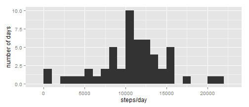
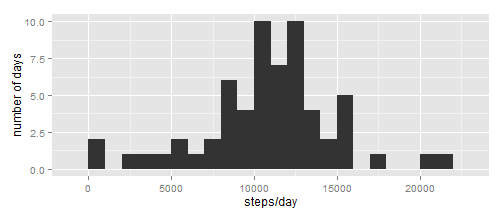
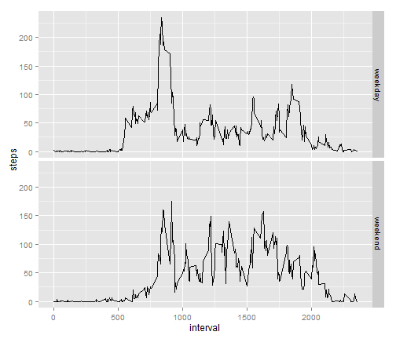

## Introduction

Welcome to my code, first of all we are going to load some things we need to run the script below.


```r
library(knitr)
library(lubridate)
library(ggplot2)
library(dplyr)
```

And we are going to set the global default `echo = TRUE`, so from here on we don't have to worry about it. We also set the default figure height for the document.


```r
opts_chunk$set(echo = TRUE, fig.height = 3)
```

## Loading and preprocessing the data

We have to load the data, easy peasy, two lines and we have all of it stored in a variable and the date column transformed to real dates.


```r
data <- read.csv("activity.csv")
data$date <- ymd(data$date)
```

## What is mean total number of steps taken per day?

Now we start with the real code. We have tu calculate the total number of steps taken every day, make a histogram with it and finally report the mean and the median.

So, first we take the data, group it by date and sum all the steps taken each day.


```r
datadays <- data %>%
    group_by(date) %>%
    summarize(steps = sum(steps))
```

Then we make the histogram with ggplot2.


```r
d <- qplot(x = steps, 
           data = datadays,
           binwidth = 1000,
           xlab = "steps/day",
           ylab = "number of days")

d
```

 

And finally we report the mean and the median.


```r
mean(datadays$steps, na.rm = TRUE)
```

```
## [1] 10766.19
```


```r
median(datadays$steps, na.rm = TRUE)
```

```
## [1] 10765
```

## What is the average daily activity pattern?

Now we'll take a look at the daily activity pattern, we'll make a line plot of the daily activity and report the maximum average of the 5-minute intervals.

We start, as always, rearranging the data to suit our needs. We group it by intervals, and get the mean for each interval. We also arrange the data in a way not conspicuous at all.


```r
dataintervals <- data %>%
    group_by(interval) %>%
    summarize(steps = mean(steps, na.rm = TRUE)) %>%
    arrange(desc(steps))
```

And here's the plot!


```r
i <- qplot(x = interval,
           y = steps,
           data = dataintervals,
           geom = "line")

i
```

 

So, you say you want to know the 5-minute interval maximum average? Here you go.


```r
head(dataintervals, n = 1)
```

```
## Source: local data frame [1 x 2]
## 
##   interval    steps
## 1      835 206.1698
```

You are welcome.

## Imputing missing values

And here's the moment we've all benn waiting for, the brain scratching. We'll have to report the number of missing values in the dataset, think of a strategy to fill them and follow the same steps we did in the first part, make a histogram and report the mean and the median, so we can compare the two datasets. Brace yourself, because here we go.

The number of missing values:


```r
sum(is.na(data$steps))
```

```
## [1] 2304
```

OK, I'm done, see you!

I'm joking, you're not going to get rid of me this easily. Here's what we're going to do: we're going to calculate the mean for each interval in each day of the week, and then fill the missing values with these ones. To do that first we need to know which day of the week correspond to each date.


```r
data$day <- wday(data$date, label = TRUE)
```

So far so good. Now we have to calculate the means for each interval in each day, no problem, we've been doing things like these all day. We group the data by those two variables and calculate the mean.


```r
filler <- data %>%
    group_by(day, interval) %>%
    summarize(steps = mean(steps, na.rm = TRUE))
```

And here comes the meat. We merge the two datasets, we replace the ```NA``` with the value from the new column, and then we clean up the mess we've made.


```r
datacomplete <- merge(data, filler, by = c("day", "interval"))

datacomplete$steps.x[is.na(datacomplete$steps.x)] <- datacomplete$steps.y[is.na(datacomplete$steps.x)]

datacomplete <- datacomplete %>%
    select(day, date, interval, steps = steps.x) %>%
    arrange(date, interval)
```

Yes, I know I didn't have to arrange the dataset, but my OCD made me do it.

Finally we can get the results. We've done this before, so I'm going to spare you the explanation, but what I'm going to do is repeat the first results to easily compare them.


```r
datacompleteday <- datacomplete %>%
    group_by(date) %>%
    summarize(filledsteps = sum(steps))

dc <- qplot(x = filledsteps, 
           data = datacompleteday,
           binwidth = 1000,
           xlab = "steps/day",
           ylab = "number of days")

d
```

 

```r
dc
```

 


```r
mean(datacompleteday$filledsteps)
```

```
## [1] 10821.21
```

```r
mean(datadays$steps, na.rm = TRUE)
```

```
## [1] 10766.19
```


```r
median(datacompleteday$filledsteps)
```

```
## [1] 11015
```

```r
median(datadays$steps, na.rm = TRUE)
```

```
## [1] 10765
```

As I (blindly) expected, the results change a little bit from the original data. Maybe the strategy chosen to fill the missing data is not the best, or maybe I lack the statistical knowledge to say that the changes are so small that they are not relevant. I'm inclined to say it's the first one.

## Are there differences in activity patterns between weekdays and weekends?

In this last part we have to find out if there are differences in the pattern of the average number of steps using a two line plots. 

First we have to know which days are weekdays and which are weekends, we alredy know which days of the week are each day, and we use it to make a new column checking for Saturdays and Sundays. We then group the data by weekday and intervals and calculate the mean.


```r
data$weekday <- ifelse(data$day == "Sat" | data$day == "Sun", "weekend", "weekday")

dataweekday <- data %>%
    group_by(weekday, interval) %>%
    summarize(steps = mean(steps, na.rm = TRUE))
```

And here's the plot.


```r
wd <- qplot(x = interval,
            y = steps,
            data = dataweekday,
            geom = "line",
            facets = weekday ~ .)

wd
```

 

It's easy to see the differences, on weekdays the activity starts earlier and suddenly around the interval 500, and between the intervals 750 and 1000 there's a high peak of activity. On weekends the activity starts more gradually between the intervals 500 and 750, and overall there's more activity but without high peaks.

And this is the where our paths separate. Have a good life and thank you for your time.
